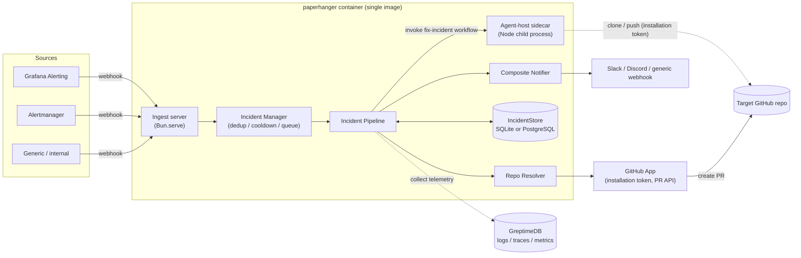
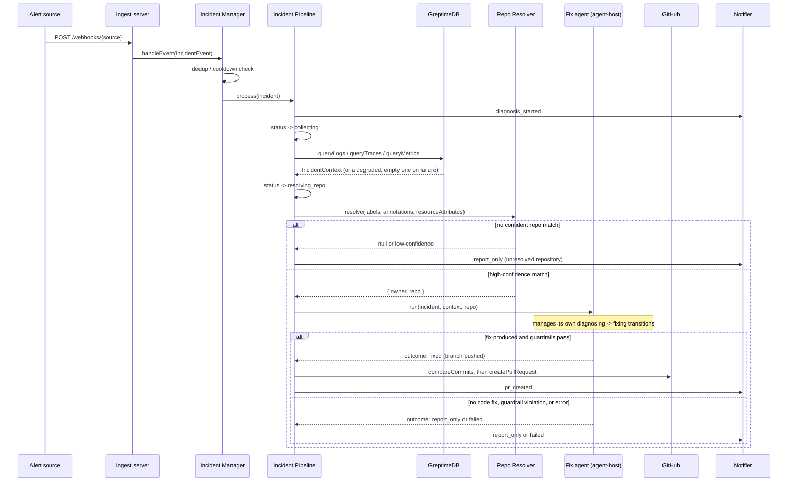

# paperhanger

paperhanger turns a firing alert into a reviewable fix, with no human in the
loop until the pull request lands:

**alert → telemetry collection → Flue agent diagnosis → auto fix PR**

Given a webhook alert (Grafana Alerting, Prometheus Alertmanager, or a
generic internal format), paperhanger deduplicates it against any
in-progress incident, collects the surrounding logs/traces/metrics from
GreptimeDB, resolves which GitHub repository is responsible, and hands the
whole bundle to a [Flue](https://flueframework.com/) agent that diagnoses
the root cause and, when it can, clones the repo, writes a fix, runs the
tests, and opens a pull request. When it can't confidently resolve a
repository, or the agent decides the issue isn't a code fix (infra/config/
data problem), paperhanger stops at a diagnosis report instead of guessing.
Every step and outcome is announced through a pluggable notifier (Slack,
Discord, or a generic webhook).

paperhanger never auto-merges, never redeploys, and never polls for alerts
-- see [docs/spec.md](docs/spec.md) section 1 for the full goals/non-goals,
and [docs/architecture.md](docs/architecture.md) for module layout and
coding conventions.

## Architecture



### Incident lifecycle sequence



## Incident state machine

```
received → collecting → resolving_repo → diagnosing → fixing
  → pr_created | report_only | failed | skipped
```

- **pr_created** -- a fix branch was pushed and a PR was opened.
- **report_only** -- either the repository could not be confidently
  resolved, or the agent diagnosed the issue as something code can't fix
  (infra/config/data). The diagnosis is notified either way.
- **failed** -- the agent could not produce a working fix (tests failed,
  guardrail violation, timeout, or an unexpected error anywhere in the
  pipeline), always with a reason.
- **skipped** -- the underlying alert resolved itself before paperhanger
  started processing it (still queued behind the concurrency limit).

Every transition is persisted through `IncidentStore` *before* the next
stage starts (see `src/core/pipeline.ts`), so a restart can always show
where an incident stopped, even mid-run. In-flight incidents are not
automatically resumed after a restart -- see "Current limitations" below.

## Quickstart

### 1. Configuration file

```bash
cp paperhanger.example.yaml paperhanger.yaml
```

Fill in the `${ENV_VAR}` references (see the [config reference](#config-reference)
below) and set the corresponding environment variables. Config is validated
at startup with `zod`; an invalid or missing config exits the process
non-zero with a readable error.

### 2. GitHub App setup (spec section 3.7)

Fix PRs are authored by a GitHub App installation, not a personal access
token:

1. Create a GitHub App (organization or personal account settings).
2. Grant these repository permissions:
   - **Contents**: Read and write
   - **Pull requests**: Read and write
   - **Metadata**: Read-only
3. If you want dynamic org search as a resolver fallback
   (`repos.orgSearch.enabled: true`), install the app **at the organization
   level** (all repos, or at least every repo you want discoverable) rather
   than on individual repositories.
4. Generate a private key (PEM, PKCS#1 or PKCS#8 both work; `\n`-escaped
   single-line env values are unescaped automatically) and note the App ID.
5. Set `GITHUB_APP_ID` and `GITHUB_APP_PRIVATE_KEY`.

PRs are opened by the App's bot identity and labeled `paperhanger` and
`automated-fix`.

### 3. Run it

Docker (recommended -- bundles both runtimes, see the Dockerfile):

```bash
docker build -t paperhanger .
docker run -p 8080:8080 \
  -v "$(pwd)/paperhanger.yaml:/app/paperhanger.yaml:ro" \
  -v paperhanger-data:/data \
  --env-file .env \
  paperhanger
```

Bare-metal (development):

```bash
bun install
(cd agent-host && bun install && bun run build)  # builds dist/server.mjs
node --version  # must be >=22.19 -- required to run agent-host/dist/server.mjs
bun run start
```

Either way, once it's up:

```bash
curl http://localhost:8080/healthz   # liveness
curl http://localhost:8080/readyz    # DB connectivity
curl http://localhost:8080/incidents # recent incidents, newest first
```

## Config reference

Every key from `paperhanger.example.yaml`, with its default when omitted
(secrets are always `${ENV_VAR}` references, never inline literals):

| Key | Default | Notes |
|---|---|---|
| `server.port` | `8080` | |
| `storage.driver` | *(required)* | `sqlite` or `postgres` |
| `storage.path` | *(required if `sqlite`)* | SQLite file path; mount `/data` as a volume |
| `storage.url` | *(required if `postgres`)* | `Bun.sql` connection string |
| `sources.<name>.secret` | `{}` (no sources) | Per-source shared secret, checked via `X-Webhook-Token` header or `?token=` query param. Map key must match an implemented adapter name: `grafana`, `alertmanager`, or `generic` |
| `telemetry.source` | *(the whole `telemetry` section is optional)* | Discriminated union like `storage`/`notifiers`; `greptimedb` is the only backend today. Omit `telemetry` entirely to run without one -- the pipeline degrades to an empty-telemetry context (see "Incident state machine") rather than failing |
| `telemetry.url` | *(required if `telemetry` is set)* | GreptimeDB HTTP endpoint |
| `telemetry.database` | *(required if `telemetry` is set)* | e.g. `public` |
| `telemetry.auth` | *(none)* | `username:password`, unencoded (base64-encoded internally) |
| `telemetry.logsTable` | `opentelemetry_logs` | Override if your deployment renamed the OTLP-ingested logs table |
| `telemetry.tracesTable` | `opentelemetry_traces` | Override if your deployment renamed the OTLP-ingested traces table |
| `telemetry.timeoutMs` | `30000` | Per-request HTTP timeout for all GreptimeDB calls |
| `collect.windowBeforeMinutes` | `30` | Telemetry window before the alert's `startsAt` |
| `collect.windowAfterMinutes` | `5` | Telemetry window after `startsAt` (capped at "now") |
| `repos.attributeKeys` | `[]` | Annotation/label/resource-attribute keys checked (in order) for an `owner/repo` value |
| `repos.mappings` | `[]` | List of `{ match: { label: value, ... }, repo: "owner/repo" }` |
| `repos.orgSearch.enabled` | `false` | Dynamic GitHub org search fallback |
| `repos.orgSearch.org` | *(none)* | Required if `orgSearch.enabled` |
| `agent.model` | `anthropic/claude-sonnet-4-6` | Flue model identifier |
| `agent.concurrency` | `2` | Max simultaneously-processing incidents; excess queues |
| `agent.timeoutMinutes` | `30` | Per-incident fix-agent timeout |
| `agent.cooldownHours` | `24` | Suppresses re-processing the same fingerprint after a terminal outcome |
| `agent.draftPr` | `false` | Open PRs as drafts |
| `agent.forbiddenPaths` | `[".github/workflows/**"]` | Glob(s) the agent may never touch; violating this fails the run instead of opening a PR |
| `agent.maxDiffLines` | `500` | Guardrail: max changed lines (additions + deletions) before a fix is rejected |
| `agent.maxFixAttempts` | `3` | Guardrail: max fix attempts (initial + test-failure retries) per incident before the agent-host workflow gives up -- see "Current limitations" for why this (plus the timeout, concurrency cap, and cooldown) is the achievable subset of cost containment |
| `agent.hostUrl` | *(unset -- spawns an internal sidecar)* | Point at an externally-deployed agent-host instead of spawning a child process |
| `agent.hostPort` | `8700` | Port the spawned agent-host listens on (ignored in external-host mode) |
| `github.appId` | *(required)* | |
| `github.privateKey` | *(required)* | PEM, PKCS#1 or PKCS#8 |
| `notifiers` | `[]` | List of `{ type: slack, webhookUrl }` / `{ type: discord, webhookUrl }` / `{ type: webhook, url }`. Empty list is valid -- no notifications are sent, everything else still works |

Environment variables read directly by the process (not via `${...}`
expansion in the YAML):

| Variable | Purpose |
|---|---|
| `PAPERHANGER_CONFIG` | Config file path (default `./paperhanger.yaml`) |
| `LOG_LEVEL` | `debug` \| `info` (default) \| `warn` \| `error` |
| `AGENT_HOST_SERVER_PATH` | Path to the built agent-host entrypoint (default `./agent-host/dist/server.mjs`; the Docker image sets this to `/app/agent-host/dist/server.mjs`) |
| `ANTHROPIC_API_KEY`, `OPENAI_API_KEY`, `OPENROUTER_API_KEY` | Forwarded to the agent-host sidecar process when set, matching `agent.model`'s provider |

## Running the compose E2E

`compose.yml` brings up the full mock stack: `paperhanger` + `greptimedb` +
`grafana` + `webhook-sink` (a 10-line Bun script standing in for a real
Slack/Discord endpoint). The mounted config (`e2e/paperhanger.yaml`)
deliberately has **no repo mappings**, so repo resolution always returns
`null` and every incident lands on `report_only` -- this "NO-LLM path" is
what makes the default stack runnable with placeholder GitHub/Anthropic
credentials and no live model calls.

```bash
docker compose up --build --wait
curl -X POST 'http://localhost:8080/webhooks/generic?token=e2e-generic-secret' \
  -H 'content-type: application/json' \
  -d '{"status":"firing","severity":"critical","title":"demo","labels":{"service":"demo"},"annotations":{},"startsAt":"2026-01-01T00:00:00Z"}'
curl http://localhost:8080/incidents      # -> status: report_only
curl http://localhost:8081/received       # -> the webhook-sink saw the notification
docker compose down -v
```

Grafana (http://localhost:3000, admin/admin) is provisioned with a
GreptimeDB Prometheus-compatible datasource and a webhook contact point +
notification policy pointing back at
`http://paperhanger:8080/webhooks/grafana?token=...`, so a real
alert-rule-driven flow is a working manual playground. It is **not**
exercised by the automated smoke test below, since Grafana's own alert
evaluation interval makes that path too slow/flaky for a fast, deterministic
test -- the script instead drives the same webhook endpoint directly with
`curl`.

### Smoke test

```bash
bash scripts/e2e-smoke.sh
```

This builds and starts the stack (`docker compose up --build --wait`),
POSTs a realistic Grafana-format alert, polls `GET /incidents` until the
incident reaches a terminal status, asserts it's `report_only` with a
diagnosis explaining the unresolved repository, asserts `webhook-sink`
received the matching `report_only` notification, and always tears the
stack down (`docker compose down -v`) on exit. Requires `docker`, `curl`,
and `jq`.

A real fix-run (an actual `pr_created` outcome) additionally needs a real
GitHub App installation (`GITHUB_APP_ID` / `GITHUB_APP_PRIVATE_KEY`), a
`repos.mappings` entry (or org search) that actually resolves a repo, and
`ANTHROPIC_API_KEY` -- set these via a `.env` file (not committed) alongside
`compose.yml`; Docker Compose picks it up automatically.

## Development

```bash
bun run test              # unit tests: src/**/*.test.ts, no Docker required
bun run test:integration   # tests/integration/**: testcontainers-backed (GreptimeDB, PostgreSQL) -- requires Docker
bun run typecheck
bun run lint
```

The agent-host (`agent-host/`) is a separate Node-only package with its own
`bun install` / `bun run build` / `bun run smoke` -- see
[`agent-host/README.md`](agent-host/README.md).

## Operational notes

- Ships as a **single container image** (Bun + Node.js, see the Dockerfile)
  so it deploys the same way on a VM, in `compose`, or in Kubernetes.
- SQLite deployments must mount `/data` as a persistent volume; PostgreSQL
  deployments (`storage.driver: postgres`) don't need it.
- `GET /healthz` -- liveness. `GET /readyz` -- checks the store connection.
  `GET /incidents` / `GET /incidents/:id` -- read-only incident inspection.
- Logs are structured JSON lines (one object per line: `level`, `ts`, `msg`,
  plus contextual fields); no OTel export of paperhanger's own logs yet
  (spec section 3.10 notes this as future work).
- Shutdown order on `SIGINT`/`SIGTERM`: stop accepting new HTTP requests,
  wait (bounded, default 10s) for in-flight incidents to drain, stop the
  agent-host sidecar, close the store. An incident still mid-flight past the
  drain timeout is abandoned at its last persisted status rather than force-
  completed -- see "Current limitations".

## Security notes

- **`GET /incidents` and `GET /incidents/:id` require `server.apiToken` by
  default-refused**: incident records can carry sensitive diagnosis/
  failureReason text, so these two read endpoints demand a bearer token
  (`Authorization: Bearer <token>` or `X-Api-Token: <token>`, constant-time
  compared) whenever `server.apiToken` is set, and return 401 with an
  explanatory body when it is *not* set -- there is no unauthenticated
  fallback. `/healthz` and `/readyz` are never gated. See
  `paperhanger.example.yaml` and the config reference above.
- **The fix agent's sandbox (`agent-host`, `local()` from
  `@flue/runtime/node`) has no isolation of its own** -- the agent-host
  container itself is the isolation boundary. Provider API keys
  (`ANTHROPIC_API_KEY`, etc.) and the GreptimeDB auth value are kept out of
  every model-facing shell by `local()`'s own env allowlist (see
  `agent-host/README.md` "Env sanitization for model-facing shells" for the
  verified mechanism), but the sandbox does **not** isolate the checked-out
  repository, the container filesystem, or network egress from
  model-directed commands. This is an accepted tradeoff for a single-tenant
  deployment; if paperhanger is ever run against untrusted/adversarial
  target repositories or in a multi-tenant configuration, switch to a
  provider-managed remote sandbox (Daytona, E2B, Cloudflare Sandbox) instead
  of `local()`.
- **Credential handling for the fix agent's git operations**: the GitHub App
  installation token embedded in the clone URL is scrubbed from the
  checkout's `origin` remote immediately after cloning and before the model
  is ever invoked; the final push uses that credential as a one-off command
  argument rather than through `origin`; and a tamper check verifies the
  remote/branch weren't altered before that push runs. See
  `agent-host/README.md` "Secret handling" for the full design.

## Current limitations

- **Fix-run toolchain availability**: the shipped image only has `git`,
  Bun, and Node. Whatever language/build toolchain a *target* repository's
  own test suite needs (Python, Go, Rust, ...) must also be present in the
  image for that repo's tests to actually run during a fix -- extend the
  Dockerfile's runtime stage for the repos you point paperhanger at.
- **Cost containment is bounded operationally, not by a true cost/token
  budget**: `@flue/sdk` does not currently expose aggregated per-workflow
  token/cost usage (see `docs/research/flue.md` and the doc comment on
  `FixAgentRunner.finalize()`), so `agent_runs.costUsd` is never recorded and
  the spec's per-incident cost-budget guardrail has no honest full
  implementation. What paperhanger enforces instead is the achievable subset:
  a wall-clock timeout per incident (`agent.timeoutMinutes`), a bounded
  number of fix attempts per incident (`agent.maxFixAttempts`), a concurrency
  cap on simultaneously-processing incidents (`agent.concurrency`), and a
  cooldown suppressing repeat runs for the same alert fingerprint
  (`agent.cooldownHours`). True token/cost budgeting is blocked on the SDK
  exposing workflow-level usage.
- **Flue is pinned to the exact version `1.0.0-beta.9`** everywhere it's
  used (both `src/agent/` and `agent-host/`). It's pre-1.0 beta software
  with an explicitly reset-only persisted schema; don't float this to a
  semver range.
- **No auto-merge, ever, by design** (non-goal, spec section 1): every fix
  lands as a normal pull request for human review. paperhanger does not
  merge, deploy, or perform any infrastructure mitigation.
- **In-flight incidents are not resumed after a restart**: the state
  machine is crash-*observable* (every transition is persisted before the
  next stage runs), not crash-*recoverable* -- an incident interrupted
  mid-pipeline stays at whatever status it last reached until a human or a
  fresh alert with the same fingerprint acts on it.
