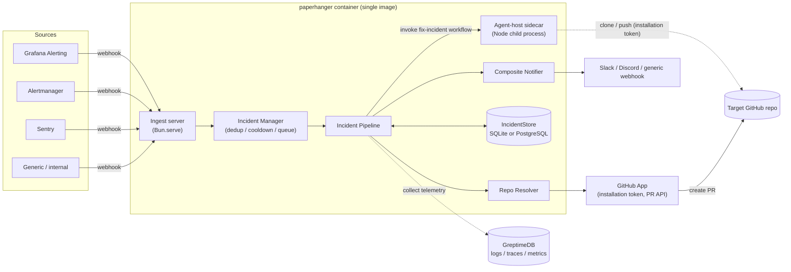
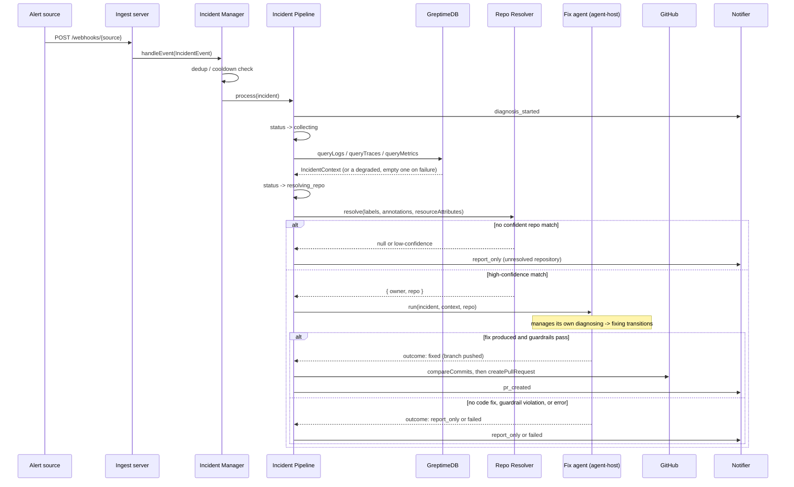

# paperhanger

paperhanger turns a firing alert into a reviewable fix, with no human in the
loop until the pull request lands:

**alert → telemetry collection → Flue agent diagnosis → auto fix PR**

Given a webhook alert (Grafana Alerting, Prometheus Alertmanager, Sentry, or
a generic internal format), paperhanger deduplicates it against any
in-progress incident, collects the surrounding logs/traces/metrics from the
configured telemetry backend (GreptimeDB, or a Grafana OSS stack of Loki/
Tempo/Prometheus), resolves which GitHub repository is responsible, and hands the
whole bundle to a [Flue](https://flueframework.com/) agent that diagnoses
the root cause and, when it can, clones the repo, writes a fix, runs the
tests, and opens a pull request. When it can't confidently resolve a
repository, or the agent decides the issue isn't a code fix (infra/config/
data problem), paperhanger stops at a diagnosis report instead of guessing.
Every step and outcome is announced through a pluggable notifier (Slack,
Discord, or a generic webhook).

paperhanger never auto-merges, never redeploys, and never polls for alerts
-- see [docs/spec.md](docs/spec.md) section 1 for the full goals/non-goals,
and [docs/architecture.md](docs/architecture.md) for module layout and
coding conventions.

## Architecture


```mermaid
flowchart LR
    subgraph Sources
      GF[Grafana Alerting]
      AM[Alertmanager]
      SE[Sentry]
      GN[Generic / internal]
    end

    GF -- webhook --> ING
    AM -- webhook --> ING
    SE -- webhook --> ING
    GN -- webhook --> ING

    subgraph container["paperhanger container (single image)"]
      ING["Ingest server\n(Bun.serve)"]
      MGR["Incident Manager\n(dedup / cooldown / queue)"]
      PIPE["Incident Pipeline"]
      RES["Repo Resolver"]
      SIDE["Agent-host sidecar\n(Node child process)"]
      STORE[("IncidentStore\nSQLite or PostgreSQL")]
      NOTIFY["Composite Notifier"]
    end

    TEL[("GreptimeDB\nlogs / traces / metrics")]
    GH["GitHub App\n(installation token, PR API)"]
    REPO[("Target GitHub repo")]
    CHAT["Slack / Discord / generic webhook"]

    ING --> MGR --> PIPE
    PIPE <--> STORE
    PIPE --> RES --> GH
    PIPE -. "collect telemetry" .-> TEL
    PIPE -- "invoke fix-incident workflow" --> SIDE
    SIDE -. "clone / push (installation token)" .-> REPO
    GH -- "create PR" --> REPO
    PIPE --> NOTIFY --> CHAT
```

### Incident lifecycle sequence


```mermaid
sequenceDiagram
    participant Alert as Alert source
    participant Ingest as Ingest server
    participant Mgr as Incident Manager
    participant Pipe as Incident Pipeline
    participant Tel as GreptimeDB
    participant Res as Repo Resolver
    participant Agent as Fix agent (agent-host)
    participant GH as GitHub
    participant Notif as Notifier

    Alert->>Ingest: POST /webhooks/{source}
    Ingest->>Mgr: handleEvent(IncidentEvent)
    Mgr->>Mgr: dedup / cooldown check
    Mgr->>Pipe: process(incident)
    Pipe->>Notif: diagnosis_started
    Pipe->>Pipe: status -> collecting
    Pipe->>Tel: queryLogs / queryTraces / queryMetrics
    Tel-->>Pipe: IncidentContext (or a degraded, empty one on failure)
    Pipe->>Pipe: status -> resolving_repo
    Pipe->>Res: resolve(labels, annotations, resourceAttributes)
    alt no confident repo match
        Res-->>Pipe: null or low-confidence
        Pipe->>Notif: report_only (unresolved repository)
    else high-confidence match
        Res-->>Pipe: { owner, repo }
        Pipe->>Agent: run(incident, context, repo)
        Note over Agent: manages its own diagnosing -> fixing transitions
        alt fix produced and guardrails pass
            Agent-->>Pipe: outcome: fixed (branch pushed)
            Pipe->>GH: compareCommits, then createPullRequest
            Pipe->>Notif: pr_created
        else no code fix, guardrail violation, or error
            Agent-->>Pipe: outcome: report_only or failed
            Pipe->>Notif: report_only or failed
        end
    end
```

## Incident state machine

```
received → collecting → resolving_repo → diagnosing → fixing
  → pr_created | report_only | failed | skipped
```

- **pr_created** -- a fix branch was pushed and a PR was opened.
- **report_only** -- either the repository could not be confidently
  resolved, or the agent diagnosed the issue as something code can't fix
  (infra/config/data). The diagnosis is notified either way.
- **failed** -- the agent could not produce a working fix (tests failed,
  guardrail violation, timeout, or an unexpected error anywhere in the
  pipeline), always with a reason.
- **skipped** -- the underlying alert resolved itself before paperhanger
  started processing it (still queued behind the concurrency limit).

Every transition is persisted through `IncidentStore` *before* the next
stage starts (see `src/core/pipeline.ts`), so a restart can always show
where an incident stopped, even mid-run. Every non-terminal incident is
automatically re-queued on the next startup, before the server accepts
webhooks (`IncidentManager.recoverOpenIncidents`), and resumes from its last
completed stage rather than reprocessing from the top: a small
`IncidentCheckpoint` persisted alongside the incident (the collected
telemetry context, and once resolved, the target repo) lets a resumed run
skip telemetry collection and/or repo resolution when they already
completed before the crash. Resuming past telemetry collection also skips
re-firing the `diagnosis_started` notification. See "Current limitations"
below for what still isn't resumable (the agent run itself always restarts
from scratch) and the narrow window that can still duplicate a
notification.

## Quickstart

### 1. Configuration file

```bash
cp paperhanger.example.yaml paperhanger.yaml
```

Fill in the `${ENV_VAR}` references (see the [config reference](#config-reference)
below) and set the corresponding environment variables. Config is validated
at startup with `zod`; an invalid or missing config exits the process
non-zero with a readable error.

### 2. GitHub App setup (spec section 3.7)

Fix PRs are authored by a GitHub App installation, not a personal access
token:

1. Create a GitHub App (organization or personal account settings).
2. Grant these repository permissions:
   - **Contents**: Read and write
   - **Pull requests**: Read and write
   - **Metadata**: Read-only
3. If you want dynamic org search as a resolver fallback
   (`repos.orgSearch.enabled: true`), install the app **at the organization
   level** (all repos, or at least every repo you want discoverable) rather
   than on individual repositories.
4. Generate a private key (PEM, PKCS#1 or PKCS#8 both work; `\n`-escaped
   single-line env values are unescaped automatically) and note the App ID.
5. Set `GITHUB_APP_ID` and `GITHUB_APP_PRIVATE_KEY`.

PRs are opened by the App's bot identity and labeled `paperhanger` and
`automated-fix`.

### 3. Run it

Docker (recommended -- bundles both runtimes, see the Dockerfile):

```bash
docker build -t paperhanger .
docker run -p 8080:8080 \
  -v "$(pwd)/paperhanger.yaml:/app/paperhanger.yaml:ro" \
  -v paperhanger-data:/data \
  --env-file .env \
  paperhanger
```

Bare-metal (development):

```bash
bun install
(cd agent-host && bun install && bun run build)  # builds dist/server.mjs
node --version  # must be >=22.19 -- required to run agent-host/dist/server.mjs
bun run start
```

Either way, once it's up:

```bash
curl http://localhost:8080/healthz   # liveness
curl http://localhost:8080/readyz    # DB connectivity
```

`GET /incidents`, `GET /incidents/:id`, `GET /incidents/:id/events`, and
every `/repo-definitions`, `/setup-scripts`, and `/system-prompt` route (the
dashboard's API -- see [Dashboard](#dashboard) below) refuse every request
with 401 unless `server.apiToken` is set in `paperhanger.yaml` (see the
[config reference](#config-reference) below) -- there is no unauthenticated
fallback:

```bash
curl -H "Authorization: Bearer $PAPERHANGER_API_TOKEN" \
  http://localhost:8080/incidents    # recent incidents, newest first
```

## Dashboard

A personal-use, configuration-and-observation UI is served from the same
process at `GET /` and `GET /dashboard` (Bun HTML import + React -- no
separate service). It manages:

- **repo definitions**: target GitHub owner/repo, label-match `mappings`, an
  optional per-repo `setupScript`, an optional `testCommand` override, and an
  optional per-repo `systemPrompt`;
- **common setup scripts**: an ordered list of scripts shared by every
  repository. Each script runs after clone only when its configured
  repository-relative trigger file exists;
- **system prompt**: a single instruction text shared by every repository,
  prepended to every fix-agent run. Clearing it disables it. This text is
  stored in plaintext and sent to the model on every run -- do not paste
  secrets into it;
- a read-only incident list/detail/event-timeline view.

All data routes require the same `server.apiToken`. The page prompts for it
once, keeps it in `localStorage`, and sends it as `X-Api-Token` on every
request. The dashboard has no merge/approve/deploy action of any kind.

### Operator instruction precedence

Two scopes exist, and the per-repository one **replaces** the common one for
that repository rather than stacking on top of it -- so a repo override must
restate anything from the common prompt it still wants to apply. Within each
scope, the dashboard-managed value beats the config-file one, and a blank
value at any level counts as unset and falls through:

| Scope | Resolution order |
|---|---|
| Per-repository | repo definition's `systemPrompt` → `repos.systemPrompts["owner/repo"]` → *(unset: inherit common)* |
| Common | dashboard `PUT /system-prompt` → `agent.systemPrompt` → *(unset: no section)* |

Every lookup is fail-soft: a storage error is logged and treated as "unset"
rather than blocking the fix run. Operator instructions never relax the
forbidden-path, diff-size, or no-commit/no-push guardrails -- see
"Security notes".

## Webhook sources

Every source posts to `POST /webhooks/{source}` and authenticates with the
per-source shared secret (`sources.<name>.secret`) via the `X-Webhook-Token`
header or a `?token=` query param. Grafana Alerting, Prometheus Alertmanager,
and the generic pass-through format need no source-side notes beyond that;
Sentry does, below.

### Sentry

The `sentry` adapter consumes
[Integration Platform](https://docs.sentry.io/organization/integrations/integration-platform/webhooks/)
webhooks -- the payload format is identical on Sentry SaaS and self-hosted
installations. Setup:

1. Add a `sentry` entry under `sources:` with its own `secret` (see
   `paperhanger.example.yaml`).
2. In Sentry, create an **internal integration** (Settings -> Custom
   Integrations) and set its webhook URL to
   `https://<paperhanger-host>/webhooks/sentry?token=<secret>`. Sentry's
   webhook settings have no custom-header field, so the token rides in the
   query string -- use HTTPS so it is not exposed in transit.
3. Subscribe the integration to the **issue** resource (state changes), and
   add a "Send a notification via an integration" action to any issue alert
   rule that should trigger diagnosis (those fire the `event_alert`
   resource).

Two resources map onto paperhanger's alert lifecycle; every other resource
(`metric_alert`, `installation`, `error`, ...) is accepted and ignored:

| Sentry webhook | paperhanger event |
|---|---|
| `event_alert` with action `triggered` (issue alert rule fired) | `firing` |
| `issue` with action `created` or `unresolved` (regression) | `firing` |
| `issue` with action `resolved` or `archived` | `resolved` |
| anything else (e.g. `issue` `assigned`) | ignored (accepted, no event) |

Normalization notes:

- **fingerprint** is the Sentry issue id, so repeated triggers of the same
  issue dedupe onto one incident, and a later `resolved` closes it.
- **severity** maps Sentry `level` into the spec vocabulary:
  `fatal`/`error` -> `critical`, `warning` -> `warning`, `info`/`debug` ->
  `info`, anything else -> `unknown`.
- **labels** carry `project`, `platform`, `culprit`, `level`, plus
  `environment`/`release`/`rule` when present; for `event_alert` payloads all
  event tags are promoted into labels too (curated fields win on conflicts),
  so repo-resolution mappings can match on tags such as `service`.
- **generatorUrl** links back to the issue/event in the Sentry UI
  (`web_url`).
- For `issue` `resolved`/`archived` the payload carries no resolution time,
  so `endsAt` comes from the `Sentry-Hook-Timestamp` header.

Sentry signs these webhooks with `Sentry-Hook-Signature` (HMAC-SHA256 of the
raw body with the integration's client secret); paperhanger deliberately does
not verify it in-process -- see "Security notes" below for the rationale and
what to do if you want it verified anyway.

## Config reference

Every key from `paperhanger.example.yaml`, with its default when omitted
(secrets are always `${ENV_VAR}` references, never inline literals):

| Key | Default | Notes |
|---|---|---|
| `server.port` | `8080` | |
| `server.apiToken` | *(unset)* | Bearer token required by `GET /incidents`, `GET /incidents/:id`, `GET /incidents/:id/events`, and every `/repo-definitions`, `/setup-scripts`, and `/system-prompt` route (the dashboard's API; see [Dashboard](#dashboard)) (`Authorization: Bearer <token>` or `X-Api-Token: <token>`). Secure by default: unset means those endpoints refuse every request with 401 -- there is no unauthenticated fallback. `/healthz` and `/readyz` are never gated |
| `storage.driver` | *(required)* | `sqlite` or `postgres` |
| `storage.path` | *(required if `sqlite`)* | SQLite file path; mount `/data` as a volume |
| `storage.url` | *(required if `postgres`)* | `Bun.sql` connection string |
| `sources.<name>.secret` | `{}` (no sources) | Per-source shared secret, checked via `X-Webhook-Token` header or `?token=` query param. Map key must match an implemented adapter name: `grafana`, `alertmanager`, `sentry`, or `generic`. Sentry cannot set custom headers, so its token rides in the webhook URL's `?token=` query param -- see [Webhook sources](#webhook-sources) |
| `telemetry.source` | *(the whole `telemetry` section is optional)* | Discriminated union like `storage`/`notifiers`: `greptimedb`, `loki`, `tempo`, `prometheus`, `clickstack`, `signoz`, `openobserve`, `datadog`, `newrelic`, `grafana`, `zabbix`, `mackerel`, or `composite`. Omit `telemetry` entirely to run without one -- the pipeline degrades to an empty-telemetry context (see "Incident state machine") rather than failing. `loki`/`tempo`/`prometheus` are single-signal sources for a Grafana OSS stack: querying the other two signals against them logs a warning and returns no results rather than failing (unlike `greptimedb`, which serves all three signals from one endpoint). `clickstack`/`signoz` have no PromQL-compatible query API, so metrics collection is unsupported for them the same way (see docs/spec.md section 3.4). Every source here is reachable through the fix agent's follow-up `query_telemetry` tool during diagnosis (the parent proxies each query over `POST /telemetry/query`; see agent-host/README.md and "Security notes" below), in addition to feeding the initial collection phase. `composite` routes each signal to its own single-backend source instead of picking one for all three -- see the dedicated row below |
| `telemetry.url` | *(required unless `telemetry` is omitted, or `telemetry.source` is `datadog`, `newrelic`, or `mackerel`)* | Backend base URL: GreptimeDB/Loki/Tempo/Prometheus HTTP endpoint, Grafana instance URL, Zabbix frontend URL (without `/api_jsonrpc.php`), ClickHouse HTTP interface (`clickstack`, e.g. `http://localhost:8123`), SigNoz instance URL (`signoz`), or OpenObserve base URL (`openobserve`) |
| `telemetry.database` | *(required if `telemetry.source` is `greptimedb` or `clickstack`)* | e.g. `public` (GreptimeDB) or `default` (ClickHouse). Not used by any other source |
| `telemetry.auth` | *(none)* | `username:password`, unencoded (base64-encoded internally as HTTP Basic auth). Used by `greptimedb`/`loki`/`tempo`/`prometheus`/`clickstack`/`openobserve`; the other sources authenticate via the dedicated fields below instead |
| `telemetry.organization` | *(required if `telemetry.source` is `openobserve`)* | Organization slug in the URL path (`/api/{organization}/...`) |
| `telemetry.logsTable` / `telemetry.tracesTable` | `opentelemetry_logs` / `opentelemetry_traces` (`greptimedb`); `otel_logs` / `otel_traces` (`clickstack`) | `greptimedb`/`clickstack` only: override if your deployment renamed the OTLP-ingested tables |
| `telemetry.logsStream` / `telemetry.tracesStream` | `default` / `default` | `openobserve` only: override if your deployment uses non-default stream names |
| `telemetry.orgId` | *(none)* | `loki` only: `X-Scope-OrgID` tenant header, for multi-tenant Loki deployments |
| `telemetry.timeoutMs` | `30000` | Per-request HTTP timeout for all calls to the configured telemetry backend |
| `telemetry.apiKey` | *(required if `telemetry.source` is `signoz`, `datadog`, `newrelic`, or `mackerel`)* | `SIGNOZ-API-KEY` (SigNoz), `DD-API-KEY` (Datadog), NerdGraph User API key (New Relic, `NRAK-...`), or `X-Api-Key` (Mackerel) |
| `telemetry.appKey` | *(required if `telemetry.source` is `datadog`)* | `DD-APPLICATION-KEY`; the logs/spans search endpoints this client uses require both keys |
| `telemetry.site` | `datadoghq.com` | Datadog only: site suffix for the API base URL, e.g. `datadoghq.eu`, `us3.datadoghq.com` (see [Datadog's site docs](https://docs.datadoghq.com/getting_started/site/)) |
| `telemetry.accountId` | *(required if `telemetry.source` is `newrelic`)* | New Relic account ID to query via NerdGraph |
| `telemetry.region` | `US` | New Relic only: `US` or `EU`, selecting the NerdGraph endpoint |
| `telemetry.serviceAccountToken` | *(required if `telemetry.source` is `grafana`)* | Grafana service-account token (`Authorization: Bearer`); a Viewer-role account with query access to the datasources below is sufficient |
| `telemetry.lokiDatasourceUid` | *(unset -- log collection skipped)* | Grafana only: UID of the provisioned Loki datasource |
| `telemetry.tempoDatasourceUid` | *(unset -- trace collection skipped)* | Grafana only: UID of the provisioned Tempo datasource |
| `telemetry.prometheusDatasourceUid` | *(unset -- metric collection skipped)* | Grafana only: UID of the provisioned Prometheus datasource |
| `telemetry.apiToken` | *(required if `telemetry.source` is `zabbix`)* | Zabbix API token, sent as `Authorization: Bearer <token>`. Assumes Zabbix >= 6.4 (see `src/telemetry/zabbix.ts`); older versions using the legacy body-based `auth` field are not supported |
| `telemetry.baseUrl` | `https://api.mackerelio.com` | Mackerel only: override, mainly for testing |
| `telemetry.source: zabbix` / `mackerel` | *(n/a -- behavioral note)* | **Zabbix and Mackerel are monitoring systems, not log/trace stores**: `queryTraces` always returns no spans (neither has a tracing concept), `queryLogs` returns problem/alert history as a best-effort substitute for error logs, and `queryMetrics` only returns a series when both a resolvable host/service label AND a metric-name hint are present. See the module doc comments in `src/telemetry/zabbix.ts` / `mackerel.ts` |
| `telemetry.logs` / `telemetry.traces` / `telemetry.metrics` | *(required: at least one, when `telemetry.source` is `composite`)* | Each slot is a full nested telemetry config (`{ source: ..., ... }`, any single-backend source above except `composite` itself -- nesting is rejected). Example for the standard Grafana OSS stack: `telemetry: { source: composite, logs: { source: loki, url: ${LOKI_URL} }, traces: { source: tempo, url: ${TEMPO_URL} }, metrics: { source: prometheus, url: ${PROMETHEUS_URL} } }`. Only the matching query method of each slot's child is ever called; an unset slot returns no results (logged once at startup, not per query). A slot's query failure degrades only that signal to empty, not the whole incident (contrast the single-source behavior in "Incident state machine"). A backend placed in a slot it structurally can't serve (e.g. `loki` under `traces:`) logs a startup warning, never a hard error -- see `src/telemetry/composite.ts`. Cross-backend trace correlation (matching a `logs:` backend's `trace_id` with a different `traces:` backend) is the operator's responsibility, and is meaningless when `logs:` is `zabbix`/`mackerel` (their problem/alert history carries no `trace_id`). The follow-up `query_telemetry` tool stays GreptimeDB-only and is never enabled for a composite, even when a slot is `greptimedb` |
| `observability.endpoint` | *(the whole `observability` section is optional)* | OTLP/HTTP traces endpoint paperhanger exports ITS OWN spans to, e.g. `http://localhost:4318/v1/traces`. Distinct from `telemetry` above, which is where paperhanger *reads* other services' telemetry from. Omit `observability` entirely to run with tracing disabled (no-op tracers, no context manager registered) |
| `observability.serviceName` | `paperhanger` | `service.name` resource attribute on exported spans |
| `observability.headers` | `{}` | Extra headers sent with every OTLP export request (values may use `${ENV_VAR}`) |
| `observability.logs.endpoint` | *(the whole `logs` subsection is optional)* | OTLP/HTTP **logs** endpoint paperhanger exports ITS OWN log lines to, e.g. `http://localhost:4318/v1/logs`. Presence of this subsection is the enable flag, mirroring `observability` itself. Stdout JSON lines remain the primary sink; this is an additional one. Omit to export traces only |
| `observability.logs.headers` | *(inherits `observability.headers`)* | Extra headers sent with every OTLP **log** export request (values may use `${ENV_VAR}`). Set only when the logs endpoint needs different auth than traces -- typical collectors share auth across signals |
| `collect.windowBeforeMinutes` | `30` | Telemetry window before the alert's `startsAt` |
| `collect.windowAfterMinutes` | `5` | Telemetry window after `startsAt` (capped at "now") |
| `repos.attributeKeys` | `[]` | Annotation/label/resource-attribute keys checked (in order) for an `owner/repo` value |
| `repos.mappings` | `[]` | List of `{ match: { label: value, ... }, repo: "owner/repo" }` |
| `repos.orgSearch.enabled` | `false` | Dynamic GitHub org search fallback |
| `repos.orgSearch.org` | *(none)* | Required if `orgSearch.enabled` |
| `repos.systemPrompts` | `{}` | Per-repository operator instructions keyed by `"owner/repo"` (matched case-insensitively). Read live per fix run -- never seeded into the DB. A dashboard-managed repo definition's own `systemPrompt` wins over the entry here; either one *replaces* the common prompt for that repository. Blank values count as unset |
| `agent.model` | `anthropic/claude-sonnet-4-6` | Flue model identifier |
| `agent.systemPrompt` | *(none)* | Config-file fallback for the common operator instructions shared by every repository. The dashboard-managed prompt (`PUT /system-prompt`) wins when set; a blank value counts as unset. Unlike the dashboard field there is no length cap here, but the same context-budget consideration applies -- this text is sent to the model on every diagnosis |
| `agent.concurrency` | `2` | Max simultaneously-processing incidents; excess queues |
| `agent.timeoutMinutes` | `30` | Per-incident fix-agent timeout |
| `agent.cooldownHours` | `24` | Suppresses re-processing the same fingerprint after a terminal outcome |
| `agent.draftPr` | `false` | Open PRs as drafts |
| `agent.forbiddenPaths` | `[".github/workflows/**"]` | Glob(s) the agent may never touch; violating this fails the run instead of opening a PR |
| `agent.maxDiffLines` | `500` | Guardrail: max changed lines (additions + deletions) before a fix is rejected |
| `agent.maxFixAttempts` | `3` | Guardrail: max fix attempts (initial + test-failure retries) per incident before the agent-host workflow gives up -- see "Current limitations" for why this (plus the timeout, concurrency cap, and cooldown) is the achievable subset of cost containment |
| `agent.hostUrl` | *(unset -- spawns an internal sidecar)* | Point at an externally-deployed agent-host instead of spawning a child process |
| `agent.hostPort` | `8700` | Port the spawned agent-host listens on (ignored in external-host mode) |
| `agent.telemetryCallbackToken` | *(unset)* | Bearer token an EXTERNALLY deployed agent-host (`agent.hostUrl` set) must present to this deployment's `POST /telemetry/query` callback route (see "Security notes" below). Ignored in the default internal mode, where the sidecar generates a random per-boot token itself -- no configuration needed there. Required to enable follow-up telemetry queries in external-host mode; the operator must also configure the same value on the external agent-host's own `PAPERHANGER_TELEMETRY_CALLBACK_TOKEN` env var |
| `github.appId` | *(required)* | |
| `github.privateKey` | *(required)* | PEM, PKCS#1 or PKCS#8 |
| `notifiers` | `[]` | List of `{ type: slack, webhookUrl }` / `{ type: discord, webhookUrl }` / `{ type: webhook, url }`. Empty list is valid -- no notifications are sent, everything else still works |

Environment variables read directly by the process (not via `${...}`
expansion in the YAML):

| Variable | Purpose |
|---|---|
| `PAPERHANGER_CONFIG` | Config file path (default `./paperhanger.yaml`) |
| `LOG_LEVEL` | `debug` \| `info` (default) \| `warn` \| `error` |
| `AGENT_HOST_SERVER_PATH` | Path to the built agent-host entrypoint (default `./agent-host/dist/server.mjs`; the Docker image sets this to `/app/agent-host/dist/server.mjs`) |
| Provider API keys | Forwarded to the agent-host sidecar process when set; the agent uses the one matching `agent.model`'s provider prefix. Supported: `ANTHROPIC_API_KEY`/`ANTHROPIC_OAUTH_TOKEN` (`anthropic/`), `OPENAI_API_KEY` (`openai/`), `OPENROUTER_API_KEY` (`openrouter/`), `KIMI_API_KEY` (`kimi-coding/`), `MOONSHOT_API_KEY` (`moonshotai/`), `GEMINI_API_KEY` (`google/`), `DEEPSEEK_API_KEY` (`deepseek/`), `XAI_API_KEY` (`xai/`), `GROQ_API_KEY` (`groq/`), `MISTRAL_API_KEY` (`mistral/`), `ZAI_API_KEY` (`zai/`), `MINIMAX_API_KEY` (`minimax/`), `FIREWORKS_API_KEY` (`fireworks/`), `TOGETHER_API_KEY` (`together/`), `CEREBRAS_API_KEY` (`cerebras/`), `HF_TOKEN` (`huggingface/`), `AI_GATEWAY_API_KEY` (`vercel-ai-gateway/`). Providers needing cloud IAM (Bedrock, Vertex, Azure) are not forwarded — use `agent.hostUrl` with an external agent-host instead |

## Running the compose E2E

`compose.yml` brings up the full mock stack: `paperhanger` + `greptimedb` +
`grafana` + `webhook-sink` (a 10-line Bun script standing in for a real
Slack/Discord endpoint). The mounted config (`e2e/paperhanger.yaml`)
deliberately has **no repo mappings**, so repo resolution always returns
`null` and every incident lands on `report_only` -- this "NO-LLM path" is
what makes the default stack runnable with placeholder GitHub/Anthropic
credentials and no live model calls.

```bash
docker compose up --build --wait
curl -X POST 'http://localhost:8080/webhooks/generic?token=e2e-generic-secret' \
  -H 'content-type: application/json' \
  -d '{"status":"firing","severity":"critical","title":"demo","labels":{"service":"demo"},"annotations":{},"startsAt":"2026-01-01T00:00:00Z"}'
curl http://localhost:8080/incidents      # -> status: report_only
curl http://localhost:8081/received       # -> the webhook-sink saw the notification
docker compose down -v
```

Grafana (http://localhost:3000, admin/admin) is provisioned with a
GreptimeDB Prometheus-compatible datasource and a webhook contact point +
notification policy pointing back at
`http://paperhanger:8080/webhooks/grafana?token=...`, so a real
alert-rule-driven flow is a working manual playground. It is **not**
exercised by the automated smoke test below, since Grafana's own alert
evaluation interval makes that path too slow/flaky for a fast, deterministic
test -- the script instead drives the same webhook endpoint directly with
`curl`.

### Smoke test

```bash
bash scripts/e2e-smoke.sh
```

This builds and starts the stack (`docker compose up --build --wait`),
POSTs a realistic Grafana-format alert, polls `GET /incidents` until the
incident reaches a terminal status, asserts it's `report_only` with a
diagnosis explaining the unresolved repository, asserts `webhook-sink`
received the matching `report_only` notification, and always tears the
stack down (`docker compose down -v`) on exit. Requires `docker`, `curl`,
and `jq`.

A real fix-run (an actual `pr_created` outcome) additionally needs a real
GitHub App installation (`GITHUB_APP_ID` / `GITHUB_APP_PRIVATE_KEY`), a
`repos.mappings` entry (or org search) that actually resolves a repo, and
`ANTHROPIC_API_KEY` -- set these via a `.env` file (not committed) alongside
`compose.yml`; Docker Compose picks it up automatically.

## Development

```bash
bun run test              # unit tests: src/**/*.test.ts + agent-host/src/**/*.test.ts, no Docker required
bun run test:integration   # tests/integration/**: testcontainers-backed (GreptimeDB, PostgreSQL) -- requires Docker
bun run typecheck
bun run lint
```

The agent-host (`agent-host/`) is a separate Node-only package with its own
`bun install` / `bun run build` / `bun run smoke` -- see
[`agent-host/README.md`](agent-host/README.md).

## Operational notes

- Ships as a **single container image** (Bun + Node.js, see the Dockerfile)
  so it deploys the same way on a VM, in `compose`, or in Kubernetes.
- SQLite deployments must mount `/data` as a persistent volume; PostgreSQL
  deployments (`storage.driver: postgres`) don't need it.
- `GET /healthz` -- liveness. `GET /readyz` -- checks the store connection.
  `GET /incidents` / `GET /incidents/:id` -- read-only incident inspection.
- Logs are structured JSON lines (one object per line: `level`, `ts`, `msg`,
  plus contextual fields). When `observability` is configured, log lines
  written while a span is active also carry `traceId`/`spanId` for
  correlation with the exported trace. OTel export of paperhanger's own
  *traces* happens when `observability` is configured, and OTel export of its
  own *logs* when `observability.logs` is additionally set (see the config
  reference above). Stdout JSON lines stay the primary sink either way: log
  export is an additional sink, and an exporter that is failing or
  unreachable never blocks or drops a stdout line.
- Shutdown order on `SIGINT`/`SIGTERM`: stop accepting new HTTP requests,
  wait (bounded, default 10s) for in-flight incidents to drain, stop the
  agent-host sidecar, flush and shut down tracing (bounded, 5s), flush and
  shut down log export (bounded, 5s -- after tracing, so diag messages from
  tracing's own shutdown are still captured), close the
  store. An incident still mid-flight past the drain timeout is abandoned at
  its last persisted status rather than force-completed -- see "Current
  limitations".
- Shutdown time budget: the drain, tracing-shutdown, and log-export-shutdown
  phases are bounded (10s + 5s + 5s), but the sidecar stop in between is not,
  so worst case is ~20s plus however long the agent-host sidecar takes to
  exit (the 5s tracing bound applies only when `observability` is configured,
  and the 5s log-export bound only when `observability.logs` is set on top of
  it). This exceeds Docker's default 10s stop grace period, so a slow
  shutdown can be SIGKILLed before `store.close()` runs, severing the
  storage handle uncleanly. Set the container termination grace period to
  at least ~30s in production (Compose's `stop_grace_period`, Kubernetes'
  `terminationGracePeriodSeconds`).
- **mise/Nix on-demand installs land on the container's writable layer, not
  a volume**: only `/data` is a `VOLUME` (see the Dockerfile). Recreating
  the container (a redeploy, `docker compose up` after a `down`, a
  Kubernetes pod reschedule, ...) throws away every language mise installed
  on demand for prior fix runs, so the next run that needs one of them pays
  the install cost again -- see "Current limitations" above. Mount
  `${MISE_DATA_DIR:-/root/.local/share/mise}` (and `/nix`, if Nix installs
  matter for your workload) as a volume to persist installs across
  recreates, if that tradeoff matters for your deployment.

## Security notes

- **`GET /incidents`, `GET /incidents/:id`, `GET /incidents/:id/events`,
  every `/repo-definitions` route, every `/setup-scripts` route, and the
  `/system-prompt` route require `server.apiToken` by default-refused**:
  incident records can carry sensitive diagnosis/failureReason text, while
  repository definitions, common setup scripts, and the common system prompt
  can carry infrastructure commands or operator instructions. These routes
  demand a bearer token (`Authorization: Bearer <token>` or
  `X-Api-Token: <token>`, constant-time compared) whenever `server.apiToken`
  is set, and return 401 with an explanatory body when it is *not* set. The
  dashboard's static page itself (`GET /` and `GET /dashboard`) is
  unauthenticated, since it carries no data of its own.
  `/healthz` and `/readyz` are never gated. See `paperhanger.example.yaml`
  and the config reference above.
- **`POST /telemetry/query`** (the agent-host sidecar's `query_telemetry`
  follow-up-query callback; see agent-host/README.md) is gated by a
  DEDICATED bearer token, deliberately separate from `server.apiToken` above
  -- telemetry-read permission is not the same grant as dashboard/incident
  CRUD. In the default internal agent-host mode this token is generated
  randomly per boot and passed to the spawned child through its own
  environment only, never persisted or logged; there is nothing to
  configure. In external agent-host mode (`agent.hostUrl` set), set
  `agent.telemetryCallbackToken` and configure the same value on the
  external agent-host's own environment, or the route stays disabled
  (503) -- there is no unauthenticated fallback. The route itself responds
  503 whenever no telemetry backend is configured at all.
- **Webhook endpoints (`POST /webhooks/{source}`) all authenticate the same
  way**: a per-source shared secret presented as `X-Webhook-Token` or
  `?token=`, constant-time compared before the body is read. Source-specific
  signature schemes are intentionally NOT verified in-process -- notably
  Sentry's `Sentry-Hook-Signature` (HMAC-SHA256 of the raw body with the
  integration's client secret). The `SourceAdapter` contract receives only
  the request and has no per-adapter secret plumbing, so verifying it would
  mean widening the shared contract (or special-casing one source) and
  breaking the uniform auth model; the shared secret already gates every
  webhook call with equivalent strength. Put paperhanger behind HTTPS so the
  token (which for Sentry rides in the webhook URL's query string) is not
  exposed in transit, and if your threat model additionally requires Sentry's
  native signature verification, enforce it at a reverse proxy in front of
  paperhanger.
- **The fix agent's sandbox (`agent-host`, `local()` from
  `@flue/runtime/node`) has no isolation of its own** -- the agent-host
  container itself is the isolation boundary. Provider API keys
  (`ANTHROPIC_API_KEY`, etc.) and the telemetry callback bearer token are
  kept out of every model-facing shell by `local()`'s own env allowlist (see
  `agent-host/README.md` "Env sanitization for model-facing shells" for the
  verified mechanism). The agent-host process now holds fewer secrets than
  before: it never receives a telemetry backend's URL, database name, or
  auth value at all -- the parent proxies every follow-up query itself (see
  `POST /telemetry/query` above). The sandbox does **not** isolate the checked-out
  repository, the container filesystem, or network egress from
  model-directed commands. This is an accepted tradeoff for a single-tenant
  deployment; if paperhanger is ever run against untrusted/adversarial
  target repositories or in a multi-tenant configuration, switch to a
  provider-managed remote sandbox (Daytona, E2B, Cloudflare Sandbox) instead
  of `local()`.
- **Credential handling for the fix agent's git operations**: the GitHub App
  installation token embedded in the clone URL is scrubbed from the
  checkout's `origin` remote immediately after cloning and before the model
  is ever invoked; the final push uses that credential as a one-off command
  argument rather than through `origin`; and a tamper check verifies the
  remote/branch weren't altered before that push runs. See
  `agent-host/README.md` "Secret handling" for the full design.

## Current limitations

- **Fix-run toolchain availability**: the shipped image bundles `git`, Bun,
  Node, a C/C++ toolchain (gcc/clang/cmake/ninja/conan), Docker/GitHub/
  PostgreSQL/Redis CLIs, and [mise](https://mise.jdx.dev/) + [Nix](https://nixos.org/)
  as on-demand sources for anything else a target repo's test suite needs.
  Python, Go, Rust, Java (+Maven/Gradle), Ruby, PHP, .NET, and Deno are
  *not* pre-installed in the image (building Ruby/PHP from source alone
  added ~15 minutes per build) -- they install on demand, the first time the
  model runs one of them. This isn't mise's own shims (those only work for a
  tool mise has already installed once, so they can't front a cold-start
  install -- see the Dockerfile's mise step); it's a thin wrapper wired up
  under every binary name those tools provide that calls `mise exec` instead.
  For Python/Go/Ruby/Java/Deno/.NET/Rust, *which version* installs is the
  target repo's own call: mise reads that repo's own idiomatic version file
  (`.python-version`, `.go-version`, `.ruby-version`, `.java-version`/
  `.sdkmanrc`, `.deno-version`/`package.json`, `global.json`,
  `rust-toolchain.toml`) when the checkout has one, falling back to
  `.mise.toml`'s pinned version only when it doesn't -- see the `[settings]`
  block atop `.mise.toml` for how that's wired up, and why Maven/Gradle/PHP
  can't join it (they're vfox/aqua-backed, not mise-core, and idiomatic
  version file detection is a mise-core-only feature) and always get
  `.mise.toml`'s pinned version regardless of the target repo. A
  `.tool-versions` file (the asdf-compatible format) in the target repo is a
  second way to pin a version and, unlike idiomatic version files, works for
  *every* mise-managed tool including Maven/Gradle/PHP (verified
  empirically) -- it's a plain mise/asdf project-config file, not a
  per-backend feature. Either way,
  the first fix run that touches a given language+version pays a one-time
  install cost (network access required; Ruby/PHP compile from source) and
  every run after that is fast, **as long as the same container is still
  running** -- see "Operational notes" below for why a recreated container
  loses that cache.
  Node/Bun themselves are intentionally *not* mise-managed -- see the
  comment atop `.mise.toml` and `AGENT_HOST_NODE_PATH` in the Dockerfile for
  why. A few things this doesn't cover:
  - **Automatic test-command detection** (`detectTestCommand()` in
    `agent-host/src/lib/test-detection.ts`) recognizes Node
    (npm/yarn/pnpm/bun), Go, Rust, Python, Ruby, Java (+Maven/Gradle), PHP,
    .NET, and Deno project markers, in that precedence order: `package.json`
    `scripts.test`, `go.mod`, `Cargo.toml`, pytest markers (`pytest.ini`,
    `tox.ini`, `setup.cfg`, or a `pyproject.toml` with a `[tool.pytest...]`
    section -- a bare `requirements*.txt` is deliberately *not* one, since a
    dependency manifest doesn't declare a test suite and detection runs no
    install step, so `python -m pytest` would fail deterministically), a
    `Gemfile` with `spec/` (`bundle exec rspec`) or `test/` (`bundle exec
    rake test`), `pom.xml` or a Gradle build file (preferring a checked-in
    `mvnw`/`gradlew` wrapper over the global binary), `composer.json` with
    `phpunit.xml(.dist)` (`vendor/bin/phpunit`), a root-level `*.sln`/
    `*.csproj` (`dotnet test`), and `deno.json(c)` (a defined `tasks.test`
    runs as `deno task test`, mirroring how `package.json` `scripts.test`
    wins over the toolchain default; otherwise the built-in `deno test`).
    For any other language the toolchain is still available for the model's
    own shell commands, but paperhanger won't pick a test command for it
    automatically. One bound nuance to be aware of: a detected language's
    on-demand install now happens inside the deterministic
    `detectAndRunTests()` step's separate 10-minute bound
    (`TEST_SHELL_TIMEOUT_MS` in `agent-host/src/fix-incident.ts`), so a
    cold-start first detected run for a language that compiles from source
    (e.g. PHP, ~13 minutes) can hit that bound while the toolchain is still
    installing and surface as a failed test run even though nothing about
    the repo's tests actually failed -- the model can still complete the
    install through its own shell commands, which remain bounded only by
    `agent.timeoutMinutes` for the whole fix attempt, after which detected
    runs are fast as long as the same container is still running.
  - **Docker**: CLI + compose plugin only, no `dockerd` -- the fix agent can
    drive a Docker daemon reachable via a bind-mounted host
    `/var/run/docker.sock`, which is an operator/deploy-time setup, not
    something this image provides on its own (running a nested `dockerd`
    here would need `privileged: true`, undermining the isolation model in
    "Security notes" below).
  - **PostgreSQL/Redis**: client CLIs only (`psql`, `redis-cli`); a target
    repo's integration tests still need a real server reachable over the
    network (e.g. `testcontainers`, or a service in the deploy environment).
  - **On-demand installs can misfire under GitHub API rate limiting or
    transient network timeouts**: `mise-tool-wrapper`'s per-tool lockfile
    (see the Dockerfile's mise step) distinguishes a tool's build script
    legitimately re-invoking itself (PHP's configure probing for an
    existing `php`) from a tool legitimately shelling out to a different
    one (Maven's `mvn` launcher calling `java`) -- but when mise's *own*
    remote-version lookup fails (rate limit, timeout) and it retries or
    falls back internally, that can also re-invoke this same wrapper while
    the outer call is still "installing," which one 2-second retry usually
    but not always tells apart from a genuine stuck self-reference
    (verified empirically against ruby/rust while this image's own testing
    had exhausted unauthenticated GitHub API quota -- 60 requests/hour).
    Unlikely to matter at normal fix-run request rates; if it does, a
    failed shell command here is something the model can simply retry.
- **Cost containment is bounded operationally, not by a true cost/token
  budget**: `@flue/sdk` does not currently expose aggregated per-workflow
  token/cost usage (see `docs/research/flue.md` and the doc comment on
  `FixAgentRunner.finalize()`), so `agent_runs.costUsd` is never recorded and
  the spec's per-incident cost-budget guardrail has no honest full
  implementation. What paperhanger enforces instead is the achievable subset:
  a wall-clock timeout per incident (`agent.timeoutMinutes`), a bounded
  number of fix attempts per incident (`agent.maxFixAttempts`), a concurrency
  cap on simultaneously-processing incidents (`agent.concurrency`), and a
  cooldown suppressing repeat runs for the same alert fingerprint
  (`agent.cooldownHours`). True token/cost budgeting is blocked on the SDK
  exposing workflow-level usage.
- **Flue is pinned to the exact version `2.0.1`** everywhere it's used
  (both `src/agent/` and `agent-host/`). It's no longer pre-1.0 beta, but
  don't float this to a semver range: the `1.0.0-beta.9` -> `2.0.1` upgrade
  was a breaking redesign that required a code migration (PR #8), and
  persisted state can still be incompatible across versions (at 2.x a
  database written by an incompatible Flue version refuses to start rather
  than migrating in place). Upgrades stay deliberate, tested changes.
- **No auto-merge, ever, by design** (non-goal, spec section 1): every fix
  lands as a normal pull request for human review. paperhanger does not
  merge, deploy, or perform any infrastructure mitigation.
- **Restart recovery resumes from the last completed stage, but the agent
  run itself always restarts from scratch**: on startup, every non-terminal
  incident is automatically re-queued (`IncidentManager.recoverOpenIncidents`)
  and resumed via a per-incident `IncidentCheckpoint` (the collected
  telemetry context, and once resolved, the target repo -- see
  `IncidentStore.saveIncidentCheckpoint`/`getIncidentCheckpoint` and
  `IncidentPipeline.process`'s `loadResumePlan` in `src/core/pipeline.ts`).
  A crash during `resolving_repo` (after telemetry collection completed)
  skips straight to repo resolution instead of re-collecting telemetry; a
  crash during `diagnosing`/`fixing` (after repo resolution also completed)
  skips both and goes straight back into the agent stage. What resume does
  *not* do is pick the agent run itself back up mid-flight: `diagnosing`/
  `fixing` are only ever reached by calling `FixAgentRunner.run()`, which has
  no resumable checkpoint of its own here, so a crash at either of those
  statuses re-runs the whole clone/diagnose/fix/test cycle from scratch, with
  a fresh `agent.timeoutMinutes`/`maxFixAttempts` budget -- exactly as a full
  pipeline restart already did before this checkpointing existed. A
  duplicate `diagnosis_started` notification is now only possible for a
  crash in the narrow window before telemetry collection finishes (before
  its checkpoint is saved); once a checkpoint exists, resuming past it skips
  re-firing that notification entirely.
